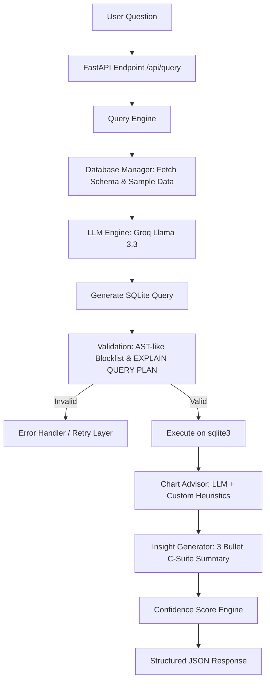

# 🧠 NeuralBI — Conversational Business Intelligence Dashboard API

[](https://fastapi.tiangolo.com/)
[](https://groq.com/)
[](https://www.sqlite.org/)
[](https://pandas.pydata.org/)
[](https://www.python.org/)

**NeuralBI** is a production-ready, highly modular Conversational Business Intelligence (BI) Dashboard API that enables natural language data querying, automatic SQL generation, schema verification, smart charting recommendations, and automated executive business insights. 

Built using **FastAPI** for high-performance async API processing, **SQLite** for structural data storage, and integrated with the **Groq API** (utilizing `llama-3.3-70b-versatile` by default) for state-of-the-art NLP-to-SQL logic.

---

## 🚀 Key Capabilities & Architectural Highlights

### ⚡ Full NLP-to-SQL Pipeline
Parses natural language questions, extracts database schema metadata, generates optimized SQL queries, validates them using transaction safety checks (`EXPLAIN QUERY PLAN`), executes them, and maps the output dataset seamlessly.

### 📊 Smart Chart Advisor
Decides the most optimal charting technique (Line, Bar, Pie, Area, Scatter, Stacked Bar, Grouped Bar) using LLM reasoning combined with custom-engineered domain heuristics (e.g., automatically converting Pie charts to Bar charts if category size exceeds 7 to avoid visual clutter).

### 💡 C-Suite Insight Generator
Synthesizes raw data records into exactly three high-impact, quantified business insights in plain, professional English (e.g., *"East leads with 34% revenue share"* or *"August sales spiked 22% vs prior month"*).

### 🔄 Contextual Dialogues & Conversational State
Manages user sessions, remembers the last executed query/context, and supports natural conversational adjustments (e.g., *"filter for only West region"* or *"change the chart type to line"*) using automated operations (`FILTER`, `MODIFY`, `RECHART`, `NEW_QUERY`).

### 📥 Automated CSV Ingestion
Provides endpoints to dynamically upload any CSV file, auto-sanitizes it, auto-detects data types, and ingests it into SQLite as a queryable database table.

### 🛡️ Robust Security Guardrails
Implements rigorous safety boundaries (rejects dangerous commands like `DROP`, `DELETE`, `INSERT`, `UPDATE`, `ALTER`, `CREATE` via validation layers), handles rate-limiting gracefully using exponential backoff, and provides a multi-stage execution duration tracker.

### 🎯 Confidence Score Engine
Computes a detailed query confidence score (0-100%) dynamically based on query length, column/schema matches, subjective query terms, and execution retries.

---

## 🏗️ System Architecture

The following diagram illustrates how a natural language question progresses through the NeuralBI pipeline to return structured data, visualizations, and automated insights:



---

## 📁 Repository Structure

```directory
neuralbi-dashboard/
├── backend/
│   ├── main.py               # FastAPI server, endpoints, confidence scorer & session memory
│   ├── database.py           # SQLite connection pool, schema extractor & CSV ingestion
│   ├── llm_engine.py         # Groq client wrapper, JSON extraction & backoff retry logic
│   ├── query_engine.py       # Full Text-to-SQL pipeline lifecycle orchestrator
│   ├── chart_advisor.py      # LLM-guided visualization layout selector + heuristics
│   ├── insight_generator.py  # Data-to-text insight synthesizer & fallback stats generator
│   ├── prompt_templates.py   # System prompts for SQL, charts, insights, and dialogues
│   └── requirements.txt      # Backend Python dependencies
├── data/
│   ├── neuralbi.db           # SQLite database holding sales & customer data (WAL mode)
│   ├── sample_sales_data.csv # Exported seed data for testing
│   ├── seed_database.py      # Generates synthetic customers & sales datasets
│   └── uploaded/             # Directory where uploaded CSVs are processed
└── .gitignore                # Excludes cache, venv, temporary DB journals & secrets
```

---

## 🛠️ Module Walkthrough

### 1. `main.py` (FastAPI Server)
Acts as the central API gateway. It initializes singleton components (`DatabaseManager`, `GeminiEngine`, `QueryEngine`, etc.), manages CORS middleware, maintains in-memory conversational sessions, handles CSV uploads, and evaluates a dynamic **Confidence Score** for queries.
* **Key Feature**: Vague question checks against schema keywords. If a question is too short or lacks context, it returns dynamic suggestions based on active table names.

### 2. `database.py` (Storage Layer)
Wraps SQLite connection management. Employs `sqlite3.Row` for key-value record matching, enforces `PRAGMA foreign_keys=ON`, and runs in **WAL (Write-Ahead Logging)** mode to support concurrent reading during writes.
* **Key Feature**: `ingest_csv()` allows users to drag-and-drop any `.csv`, dynamically inferring columns and creating new database tables on the fly.

### 3. `llm_engine.py` (AI Orchestrator)
Named `GeminiEngine` for backward compatibility but fully utilizes **Groq's Llama 3.3 (70B) model** under the hood for lightning-fast inference.
* **Key Feature**: Implements exponential backoff on `429 (Rate Limit)` errors and parses raw text outputs into structured JSON objects using regex-based bracket scanners. Includes dynamic hot-reloading of `.env` configurations.

### 4. `query_engine.py` (Execution Pipeline)
Executes the four primary pipeline stages:
1. **Schema Context Injection**: Generates precise DB schemas and 3-row sample tables for the LLM.
2. **Text-to-SQL Conversion**: Prompts the LLM with the context and constraints.
3. **Safety Verification**: Blocklists modification actions (`DROP`, `ALTER`, etc.) and runs `EXPLAIN QUERY PLAN` to verify SQLite syntax.
4. **Execution**: Converts pandas DataFrames into records and columns.

### 5. `chart_advisor.py` (Visualization Brain)
Matches database outputs to the best UI charting component (e.g. Line, Bar, Pie).
* **Key Feature**: Business Heuristic Layer. If the LLM proposes a `pie` chart but the data contains more than 7 categories, the advisor automatically overrides this to a `bar` chart to maintain readability.

### 6. `insight_generator.py` (C-Suite Summarizer)
Translates query results and charting context into exactly three concise, quantified business bullets.
* **Key Feature**: Fallback Mode. If the API rate limit is reached or JSON extraction fails, a fallback engine calculates basic mathematical statistics (averages, maximums) directly via Python to guarantee an insight response.

---

## 🔌 API Endpoints Reference

### 1. Health Status
* **Endpoint**: `GET /api/health`
* **Response**:
```json
{
  "status": "ok",
  "model": "llama-3.3-70b-versatile",
  "database": "connected",
  "tables": 2,
  "total_rows": 720
}
```

### 2. Live Database Schema
* **Endpoint**: `GET /api/schema`
* **Response**:
```json
{
  "tables": [
    {
      "name": "sales",
      "row_count": 600,
      "columns": [
        { "name": "id", "type": "INTEGER", "primary_key": true },
        { "name": "date", "type": "TEXT", "primary_key": false },
        { "name": "region", "type": "TEXT", "primary_key": false },
        { "name": "revenue", "type": "REAL", "primary_key": false }
      ]
    }
  ]
}
```

### 3. Natural Language Query Pipeline
* **Endpoint**: `POST /api/query`
* **Payload**:
```json
{
  "question": "What is the total revenue by product category in 2024?",
  "session_id": "optional-uuid"
}
```
* **Response**:
```json
{
  "success": true,
  "session_id": "dbf26bf8-cfd6-44b3-b4eb-ee90cb06a09f",
  "card_id": "a4d3dfbb-8cd7-43ca-a387-512030b427b3",
  "chart_config": {
    "chart_type": "bar",
    "x_axis": "product_category",
    "y_axis": "total_revenue",
    "color_field": null,
    "title": "Total Revenue by Product Category (2024)",
    "reasoning": "Bar chart is optimal for comparing categorical revenue shares."
  },
  "data": [
    { "product_category": "Electronics", "total_revenue": 1420500.50 },
    { "product_category": "Furniture", "total_revenue": 890400.20 }
  ],
  "columns": ["product_category", "total_revenue"],
  "sql_query": "SELECT product_category, SUM(revenue) AS total_revenue FROM sales WHERE date BETWEEN '2024-01-01' AND '2024-12-31' GROUP BY product_category ORDER BY total_revenue DESC LIMIT 500",
  "insights": [
    "Electronics leads all categories with $1.42M in revenue",
    "Furniture represents the second largest segment, capturing 38% of revenue",
    "Top 2 categories account for over 70% of total annual sales"
  ],
  "confidence": 95,
  "row_count": 2,
  "processing_time_ms": 420,
  "pipeline_stages": [
    { "name": "Schema Analysis", "status": "complete", "duration_ms": 10 },
    { "name": "SQL Generation", "status": "complete", "duration_ms": 250 },
    { "name": "Validation", "status": "complete", "duration_ms": 5 },
    { "name": "Execution", "status": "complete", "duration_ms": 15 },
    { "name": "Chart Selection", "status": "complete", "duration_ms": 80 },
    { "name": "Insights", "status": "complete", "duration_ms": 60 }
  ]
}
```

### 4. Conversational Follow-Up
* **Endpoint**: `POST /api/follow-up`
* **Payload**:
```json
{
  "question": "show this as a line chart instead",
  "session_id": "dbf26bf8-cfd6-44b3-b4eb-ee90cb06a09f"
}
```
* **Response**:
```json
{
  "success": true,
  "session_id": "dbf26bf8-cfd6-44b3-b4eb-ee90cb06a09f",
  "card_id": "787c88b1-3ef5-46f9-aa29-873b88b42211",
  "chart_config": {
    "chart_type": "line",
    "x_axis": "product_category",
    "y_axis": "total_revenue",
    "title": "Total Revenue by Product Category (2024)"
  },
  "data": [...],
  "columns": [...],
  "sql_query": "SELECT product_category, SUM(revenue) AS total_revenue FROM sales WHERE date BETWEEN '2024-01-01' AND '2024-12-31' GROUP BY product_category ORDER BY total_revenue DESC LIMIT 500",
  "insights": [...],
  "confidence": 90,
  "row_count": 2,
  "processing_time_ms": 120,
  "explanation": "Updated visualization format to line chart per user request."
}
```

---

## ⚡ Getting Started & Setup

### 1. Prerequisites
- Python 3.10+
- Git

### 2. Installation
Clone the repository and install the dependencies:
```bash
# Clone the repository
git clone https://github.com/rajuyuvaraj/NeuralBI-dashboard.git
cd NeuralBI-dashboard

# Navigate to backend and create virtual environment
cd backend
python -m venv venv

# Activate virtual environment
# On Windows:
venv\Scripts\activate
# On macOS/Linux:
source venv/bin/activate

# Install required dependencies
pip install -r requirements.txt
```

### 3. Setup Configuration
Create a `.env` file inside the `backend/` directory:
```env
# GROQ Configuration (Default Engine)
GROQ_API_KEY=your_groq_api_key_here
GROQ_MODEL=llama-3.3-70b-versatile

# CORS Settings
CORS_ORIGINS=http://localhost:5173,http://localhost:3000
```

### 4. Seed the Database
NeuralBI includes a seeding script that generates realistic sales and customer datasets automatically:
```bash
# Navigate to the data folder and run seed script
cd ../data
python seed_database.py
```
This creates:
- `neuralbi.db`: Pre-populated SQLite database with 120 unique customers and 600 realistic, category-scaled sales transactions.
- `sample_sales_data.csv`: A backup CSV of the seeded sales data.

### 5. Launch the Server
Start the Uvicorn ASGI development server from the `backend/` directory:
```bash
cd ../backend
uvicorn main:app --reload --port 8000
```
Open [http://localhost:8000/docs](http://localhost:8000/docs) in your browser to interact with the Swagger API documentation.

---

## 🌟 Resume Skill Mapping

*This project is an exceptional addition to a modern software engineering or data engineering resume. Here are the core skills this codebase demonstrates:*

* **Generative AI & LLM Systems**: Modular LLM wrapping, prompt engineering, strict JSON schema generation, session history handling, and dynamic context-guided dialogues.
* **Advanced API Development**: Structured FastAPI implementation, Pydantic type safety, automated error handling, exponential backoff protocols, and CORS configuration.
* **Data Engineering**: Data modeling (Relational databases), SQLite WAL-mode tuning, transaction performance profiling, CSV ingestion pipelines, and Pandas analytical operations.
* **Systems Security & Reliability**: Multi-stage safety query validation, AST blocklists to defend against SQL injections, and resilient offline fallbacks.
